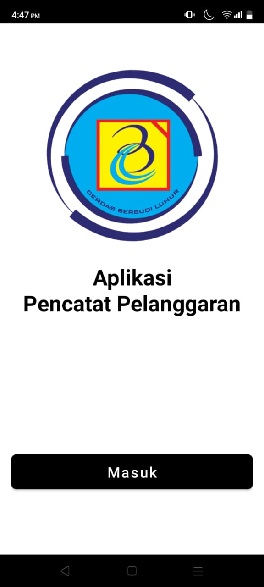
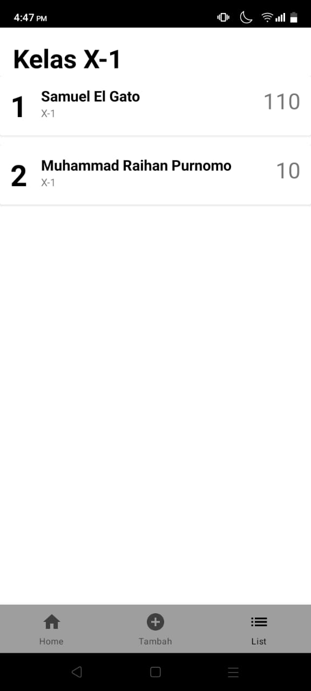
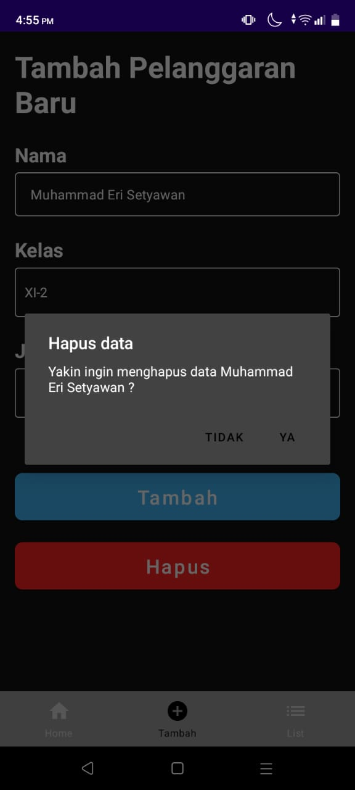

# Android-Studio-Aplikasi-Pencatat-Poin-Pelanggaran
Tugas UTS Mobile Programming Android Studio CRUD Aplikasi Pencatat Pelanggaran Menggunakan SQlite.
 
Bahasa yang digunakan `java` dengan database `SQlite`
 
SDK: `API 30 Android 11.0(R)`

# Fitur
- Tambah data
- Tambah Poin baru
- Update data
- Hapus data
- Hapus semua data
- Lihat data perkelas
- Mode Malam

# Screenshoot

    
Day Mode

     

|  |  |  |
| :---:  | :---:  | :---:  |
|             |                |   
|        |               |  
|          |    |  

  

    
Night Mode

     

|  |  |  |
| :---:  | :---:  | :---:  |
|           |              |   
|      |             |  
|        |  |  

  

## Contributors ✨
<table>
  <tr>
    <td align="center"><a href="https://github.com/EriSetyawan166"> <b>Muhammad Eri Setyawan</b></a> <a href="#" title="Code">💻</a> <a href="#" title="Documentation">📖</td>
    <td align="center"><a href="#"> <b>Rafi Zufary Pramanta</b></a> <a href="#" title="Bug reports">🐛</a> <a href="#" title="Ideas, Planning, & Feedback">🤔</a></td>
  </tr>
</table>
